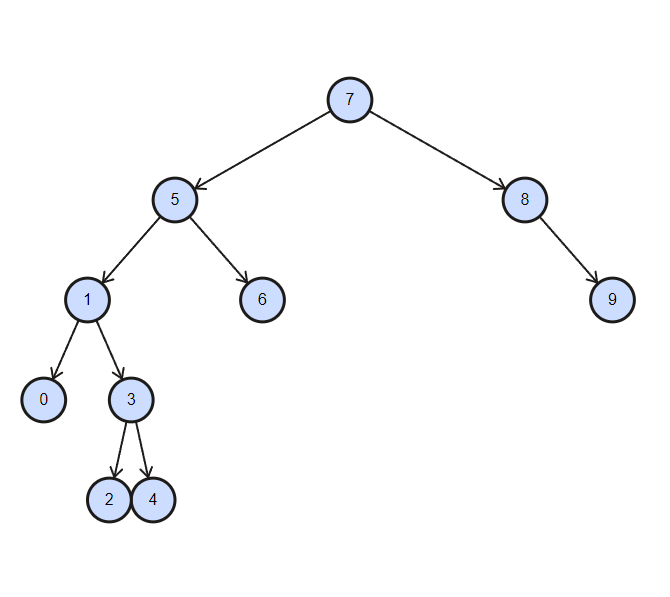

#  Binary Search Tree

## 1) Binary Search Tree of [7,5,1,8,3,6,0,9,4,2] (Step by step.)

```
- The root is 7 because it's at the beginning of the series.
- 5 is written to the left of 7 because it is less than 7.
- 1 is written to the left of 5 because it is less than 7 and 5.
- 8 is written to the right of 7 because it is greater than 7.
- 3 is written to the right of 1 because it is less than 7 and 5 but greater than 1.
- 6 is written to the right of 5 because it is less than 7 but greater than 5.
- 0 is written to the left of 1 because it is less than 7, 5 and 1.
- 9 is written to the right of 8 because it is greater than 7 and 8.
- 4 is written to the right of 3 because it is less than 7 and 5 but greater than 1 and 3.
- 2 is written to the left of 3 because it is less than 7, 5, 3 but greater than 1.
```



Algorithms and Data Structures with [Patika.dev](www.patika.dev)